# 📈 StockScope

<p align="center">
  <strong>A Full-Stack Stock Market Analysis & Paper-Trading Platform</strong>
</p>

<p align="center">
  🔍 Search · 📊 Analyze · ⭐ Track · 🔄 Compare · 💰 Practice
</p>

<p align="center">


</p>

---

## 🌟 Overview

**StockScope** is a full-stack stock market analysis platform built to make exploring, tracking, comparing, and practicing stock trading simple and interactive.

Users can search for stocks, view market movements, analyze historical prices, create personalized watchlists, compare multiple stocks, and practice buying and selling through a **paper-trading portfolio with ₹1,00,000 in virtual cash**.

The application uses **Angular 19** for the frontend and **Node.js + Express** for the backend, with **Alpha Vantage** providing market data.

> 💡 **No real money is involved.** The portfolio feature is a simulation designed for learning, experimentation, and demonstration.

---

## 🧭 Quick Navigation

* [✨ Features](#-features)
* [📸 Application Gallery](#-application-gallery)
* [🏗️ Architecture](#️-architecture)
* [🔄 How It Works](#-how-it-works)
* [🛡️ Smart Fallback System](#️-smart-fallback-system)
* [🔐 Authentication](#-authentication)
* [💰 Paper Trading](#-paper-trading)
* [🔌 API Endpoints](#-api-endpoints)
* [🛠️ Tech Stack](#️-tech-stack)
* [📁 Project Structure](#-project-structure)
* [🚀 Running Locally](#-running-locally)
* [🔒 Security](#-security)
* [⚡ Performance & Reliability](#-performance--reliability)
* [⚠️ Known Limitations](#️-known-limitations)
* [🚧 Future Improvements](#-future-improvements)

---

# ✨ Features

### 🔍 Smart Stock Search

* Search stocks by company name or symbol
* Debounced search results while typing
* Supports Indian BSE equities and major US tickers
* Example symbols:

  * `RELIANCE.BSE`
  * `TCS.BSE`
  * `AAPL`
  * `MSFT`

---

### 📊 Interactive Dashboard

Get a quick overview of the market through:

* 📈 Top Gainers
* 📉 Top Losers
* ⭐ Watchlist highlights
* 🇮🇳 Indian equities
* 🇺🇸 Major US stocks
* 📌 Market overview cards

---

### 📈 Stock Details

Each stock has a detailed view containing:

* Current price
* Day's open
* Day's high
* Day's low
* Previous close
* Trading volume
* Historical closing prices
* Interactive Chart.js price chart
* Approximately 60 trading days of history

---

### ⭐ Personal Watchlist

Logged-in users can:

* Add stocks to their watchlist
* Remove stocks
* View saved stocks
* Persist their watchlist across sessions
* Manage their watchlist through protected API endpoints

---

### 🔄 Compare Stocks

Compare up to **3 stocks simultaneously**.

The comparison page provides:

* 📊 Normalized percentage-change chart
* 📈 Overlaid historical performance
* 📋 Side-by-side statistics
* 🔎 Easy visual comparison between stocks

---

### 💰 Paper Trading

Practice trading without risking real money.

Every new portfolio starts with:

<h3 align="center">💵 ₹1,00,000 Virtual Cash</h3>

Users can:

* 🟢 Buy stocks
* 🔴 Sell stocks
* 📦 Track holdings
* 💵 Monitor available cash
* 📊 Calculate average cost
* 📈 Track profit/loss
* 🧾 View transaction history

> ⚠️ This is a paper-trading simulation. It does not connect to a brokerage and does not involve real money.

---

### 📊 Portfolio Insights

Visualize portfolio information through charts and statistics.

Includes:

* Portfolio allocation by holding
* Watchlist daily performance
* Current holding values
* Profit/loss information
* Recent transactions

---

### 🎨 Personalization

StockScope includes:

* 🌙 Dark mode
* ☀️ Light mode
* 🎨 4 accent colors
* 💾 Theme preferences persisted per browser

---

### 🛡️ Demo-Friendly Fallback

The application remains functional even when Alpha Vantage:

* Reaches its free-tier request limit
* Returns an API-level error
* Is unavailable
* Has no API key configured

Instead of breaking the application, the backend automatically switches to demo data.

---

# 📸 Application Gallery

> ✨ A visual tour of StockScope — from discovering stocks to analyzing and practicing trades.

### 🖥️ Explore StockScope

<p align="center">

<a href="./docs/screenshots/1.jpg">
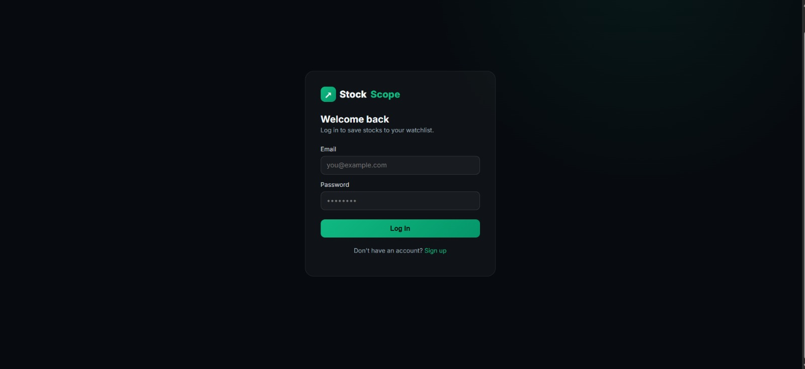
</a>

<a href="./docs/screenshots/2.jpg">
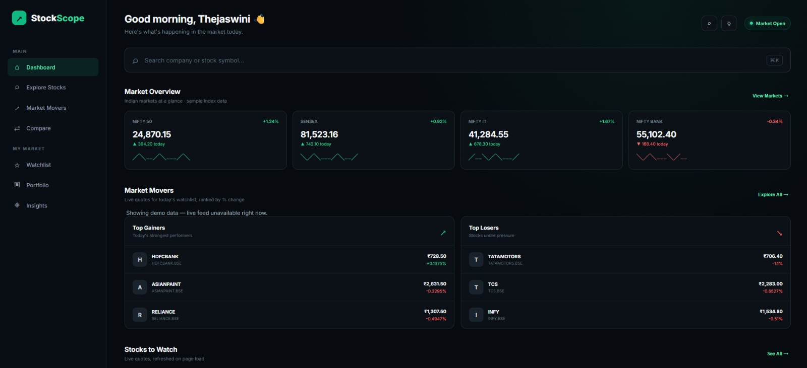
</a>

<a href="./docs/screenshots/3.jpg">
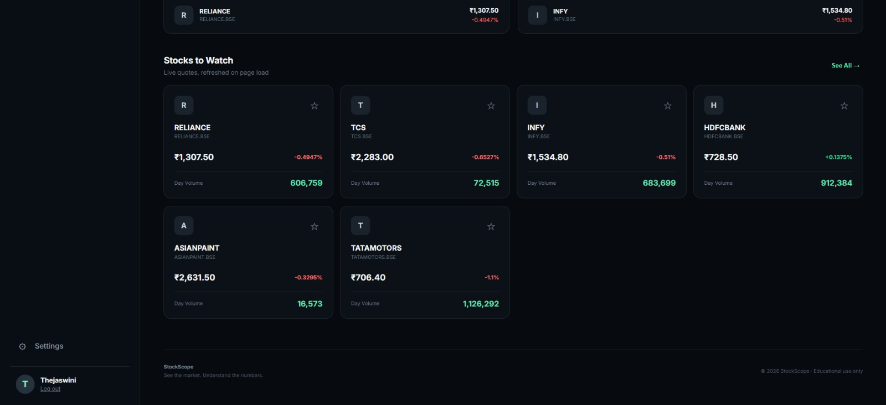
</a>

<a href="./docs/screenshots/4.jpg">
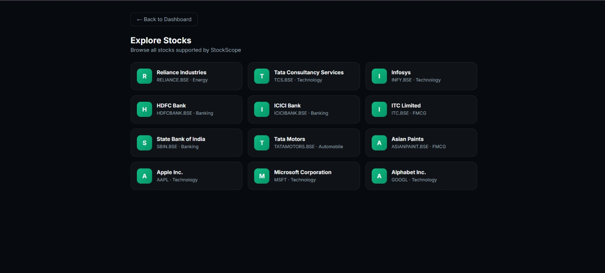
</a>

</p>

<p align="center">

<a href="./docs/screenshots/5.jpg">
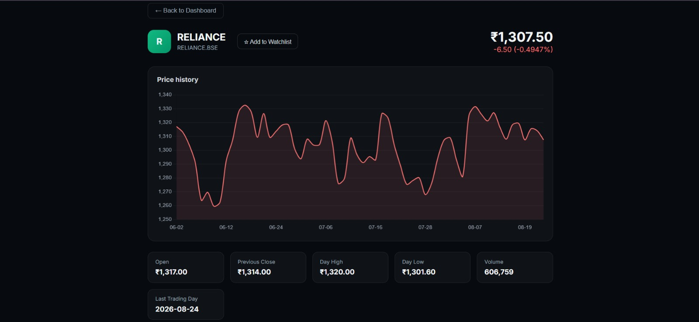
</a>

<a href="./docs/screenshots/6.jpg">
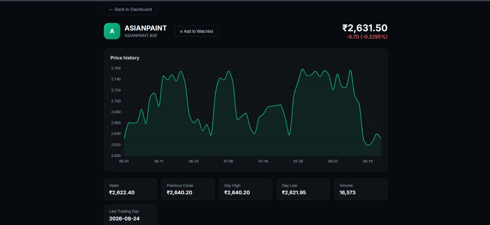
</a>

<a href="./docs/screenshots/7.jpg">
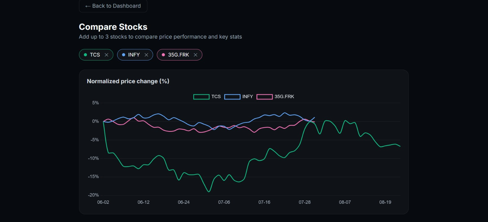
</a>

<a href="./docs/screenshots/8.jpg">
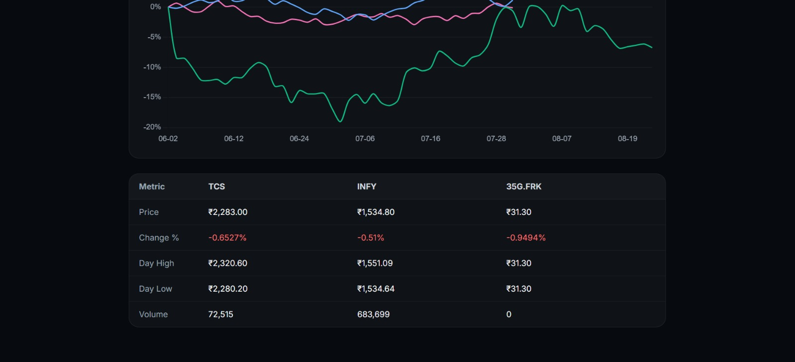
</a>

</p>

<p align="center">

<a href="./docs/screenshots/9.jpg">
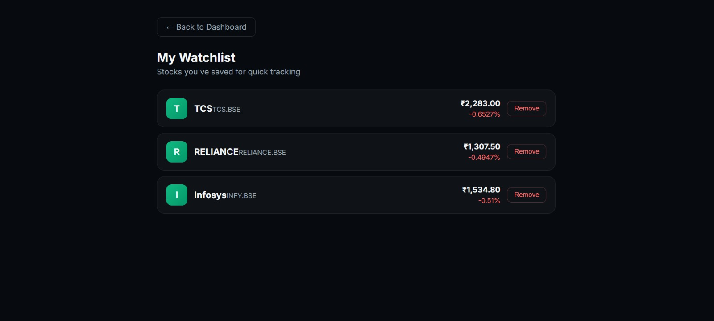
</a>

<a href="./docs/screenshots/10.jpg">
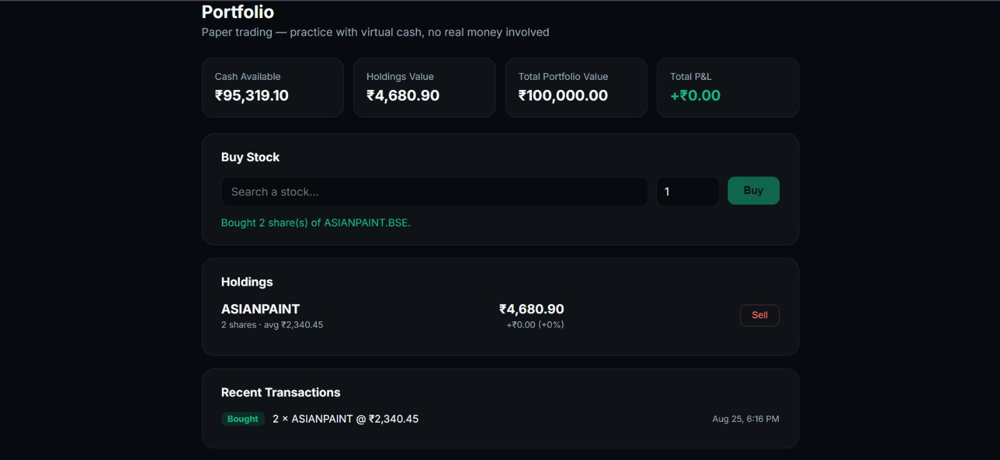
</a>

<a href="./docs/screenshots/11.jpg">
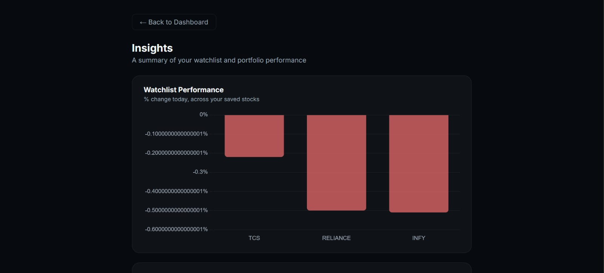
</a>

<a href="./docs/screenshots/12.jpg">
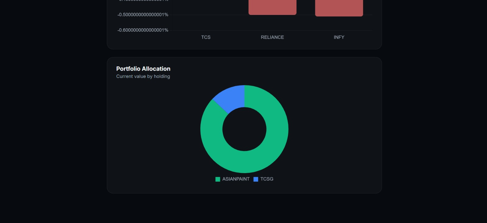
</a>

</p>

<p align="center">

<a href="./docs/screenshots/13.jpg">
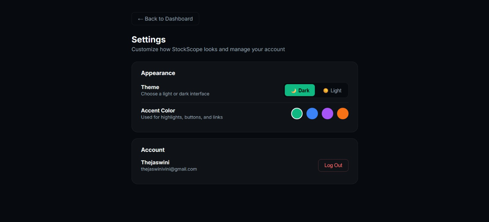
</a>

<a href="./docs/screenshots/14.jpg">
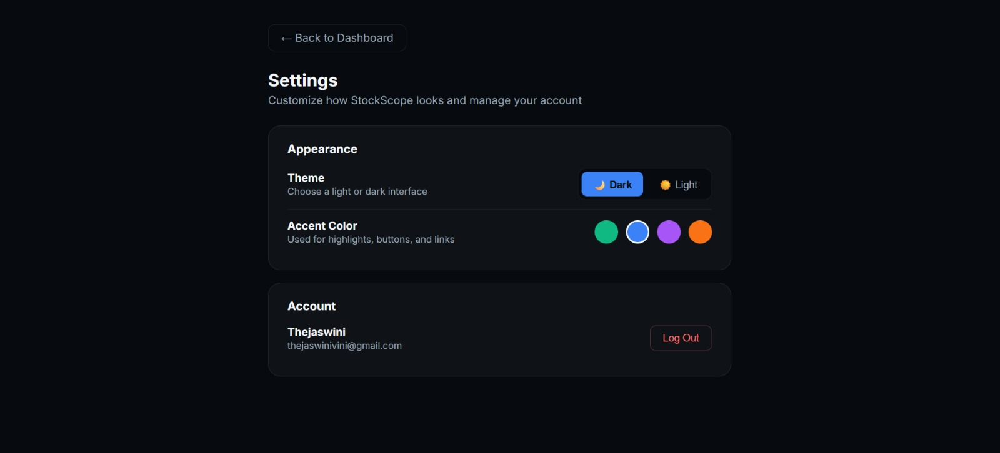
</a>

</p>

> 💡 **Click any screenshot to view it in full resolution.**

---

# 🏗️ Architecture

```text
                         👤 USER
                           │
                           ▼
              ┌─────────────────────────┐
              │    🅰️ Angular 19        │
              │                         │
              │ Dashboard               │
              │ Explore                 │
              │ Stock Details           │
              │ Compare                 │
              │ Watchlist               │
              │ Portfolio               │
              │ Insights                │
              └────────────┬────────────┘
                           │
                       HTTP / JWT
                           │
                           ▼
              ┌─────────────────────────┐
              │   🚀 Express Backend    │
              │                         │
              │ REST API                │
              │ Authentication          │
              │ Watchlist               │
              │ Portfolio               │
              │ Cache                   │
              │ Fallback Logic          │
              └────────────┬────────────┘
                           │
                 ┌─────────┴─────────┐
                 │                   │
                 ▼                   ▼
        ┌────────────────┐   ┌─────────────────┐
        │ 📡 Alpha       │   │ 💾 JSON         │
        │ Vantage        │   │ Persistence     │
        │ Market Data    │   │                 │
        └────────────────┘   │ Users           │
                             │ Watchlists       │
                             │ Portfolios       │
                             └─────────────────┘
```

### 🔑 Architecture Principle

The frontend **never communicates directly with Alpha Vantage**.

Instead:

```text
Angular
   ↓
Express API
   ↓
Cache / Alpha Vantage / Fallback Data
   ↓
Angular UI
```

This keeps the API key server-side while centralizing API requests, caching, error handling, and rate-limit management.

---

# 🔄 How It Works

### 1️⃣ User Interaction

The user interacts with the Angular application to search, analyze, compare, or trade stocks.

⬇️

### 2️⃣ Angular Frontend

Angular sends requests to the Express backend.

⬇️

### 3️⃣ Express API

The backend handles:

* API routing
* Authentication
* JWT verification
* Stock data requests
* Watchlists
* Portfolio operations
* Caching
* Fallback logic

⬇️

### 4️⃣ Data Retrieval

The backend attempts to retrieve market data from Alpha Vantage.

⬇️

### 5️⃣ Cache / Fallback

Previously retrieved data can be served from the in-memory cache.

If live data is unavailable or the API quota is exceeded, the backend switches to fallback data.

⬇️

### 6️⃣ Frontend Visualization

The processed data is returned to Angular and displayed through cards, tables, charts, and interactive components.

---

# 🛡️ Smart Fallback System

One of StockScope's key design decisions is keeping the application **demo-ready even when the external API is unavailable**.

### Normal Flow

```text
Angular
   │
   ▼
Express Backend
   │
   ▼
Alpha Vantage
   │
   ▼
Cache
   │
   ▼
Angular UI
```

### Fallback Flow

```text
Angular
   │
   ▼
Express Backend
   │
   ├──────────────► Alpha Vantage ❌
   │
   ▼
Fallback Dataset
   │
   ▼
Angular UI ✅
```

### Fallback Features

* Detects API errors
* Checks the API response body for quota messages
* Uses curated demo data for supported stocks
* Generates stable synthetic prices for unknown symbols
* Same symbol produces the same fallback price
* Real API data is always preferred when available

> 💡 **Result:** The application remains functional even when the free API quota is exhausted.

---

# 🔐 Authentication

StockScope uses **JWT-based authentication** with bcrypt password hashing.

### Registration

```text
User
 │
 ▼
Register
 │
 ▼
Password
 │
 ▼
bcrypt Hash
 │
 ▼
User Stored
 │
 ▼
JWT Returned
```

### Login

```text
Credentials
     │
     ▼
Express API
     │
     ▼
bcrypt Verification
     │
     ▼
JWT Generated
     │
     ▼
Authenticated Session
```

Protected resources include:

* User information
* Watchlist
* Portfolio
* Buy transactions
* Sell transactions

The Angular authentication interceptor automatically attaches the JWT to protected requests.

---

# 💰 Paper Trading

StockScope includes a simulated trading environment for practicing portfolio management.

### Starting Balance

<p align="center">
  <strong>💵 ₹1,00,000 Virtual Cash</strong>
</p>

### Trading Flow

```text
Select Stock
     │
     ▼
Choose Quantity
     │
     ▼
Buy / Sell
     │
     ▼
Portfolio Updated
     │
     ├── Cash Balance
     ├── Holdings
     ├── Average Cost
     ├── Current Value
     └── Profit / Loss
```

### Portfolio Tracks

| Metric           | Description                      |
| ---------------- | -------------------------------- |
| 💵 Cash          | Remaining virtual balance        |
| 📦 Holdings      | Stocks currently owned           |
| 📊 Average Cost  | Average purchase price           |
| 💰 Current Value | Current value of holdings        |
| 📈 Profit/Loss   | Unrealized portfolio performance |
| 🧾 Transactions  | Buy/sell history                 |

> 🚫 No real brokerage integration
> 🚫 No real money
> ✅ Designed for simulation and learning

---

# 🔌 API Endpoints

| Method   | Endpoint                        | Auth | Description                         |
| -------- | ------------------------------- | :--: | ----------------------------------- |
| `GET`    | `/api/health`                   |   —  | Server status and API configuration |
| `GET`    | `/api/stocks/popular`           |   —  | List supported stocks               |
| `GET`    | `/api/stocks/search?q=reliance` |   —  | Search stocks                       |
| `GET`    | `/api/stocks/quote/:symbol`     |   —  | Current stock quote                 |
| `GET`    | `/api/stocks/history/:symbol`   |   —  | Historical price data               |
| `POST`   | `/api/auth/register`            |   —  | Create account                      |
| `POST`   | `/api/auth/login`               |   —  | Login                               |
| `GET`    | `/api/auth/me`                  |   ✓  | Get current user                    |
| `GET`    | `/api/watchlist`                |   ✓  | Get user's watchlist                |
| `POST`   | `/api/watchlist`                |   ✓  | Add stock to watchlist              |
| `DELETE` | `/api/watchlist/:symbol`        |   ✓  | Remove stock                        |
| `GET`    | `/api/portfolio`                |   ✓  | Get portfolio                       |
| `POST`   | `/api/portfolio/buy`            |   ✓  | Buy shares                          |
| `POST`   | `/api/portfolio/sell`           |   ✓  | Sell shares                         |

---

# 🌎 Supported Markets

### 🇮🇳 Indian Equities

Indian BSE stocks use the `.BSE` suffix.

```text
RELIANCE.BSE
TCS.BSE
INFY.BSE
```

### 🇺🇸 US Equities

US stocks use their regular ticker symbols.

```text
AAPL
MSFT
GOOGL
AMZN
```

---

# 🛠️ Tech Stack

### 🎨 Frontend

* Angular 19
* TypeScript
* RxJS
* Chart.js
* Standalone Components

### 🚀 Backend

* Node.js
* Express.js
* REST APIs

### 🔐 Security

* JWT
* bcrypt
* Authentication middleware
* Protected routes
* Server-side API key handling

### 📊 Market Data

* Alpha Vantage API
* In-memory TTL caching
* Curated fallback dataset
* Deterministic synthetic fallback prices

### 💾 Persistence

* JSON-file persistence
* User data
* Watchlists
* Portfolio data
* Transaction history

---

# 📁 Project Structure

```text
StockScope/
│
├── 📁 src/
│   └── 📁 app/
│       │
│       ├── 📁 pages/
│       │   ├── dashboard/
│       │   ├── stock-details/
│       │   ├── explore/
│       │   ├── compare/
│       │   ├── watchlist/
│       │   ├── login/
│       │   ├── register/
│       │   └── placeholder/
│       │
│       ├── 📁 services/
│       │   ├── stock.service.ts
│       │   ├── auth.service.ts
│       │   ├── portfolio.service.ts
│       │   ├── theme.service.ts
│       │   └── watchlist.service.ts
│       │
│       ├── 📁 guards/
│       │   └── auth.guard.ts
│       │
│       └── 📁 interceptors/
│           └── auth.interceptor.ts
│
├── 📁 backend/
│   └── 📁 src/
│       │
│       ├── server.js
│       │
│       ├── 📁 routes/
│       │   ├── stocks.js
│       │   ├── auth.js
│       │   ├── watchlist.js
│       │   └── portfolio.js
│       │
│       ├── 📁 middleware/
│       │   └── auth.js
│       │
│       ├── 📁 services/
│       │   ├── alphaVantage.js
│       │   ├── cache.js
│       │   └── db.js
│       │
│       └── 📁 data/
│           └── fallbackStocks.js
│
├── 📁 docs/
│   ├── 📁 screenshots/
│   │   ├── 1.jpg
│   │   ├── 2.jpg
│   │   ├── ...
│   │   └── 14.jpg
│   │
│   └── stockscope.gif
│
├── .gitignore
├── package.json
└── README.md
```

---

# 🚀 Running Locally

## Prerequisites

Make sure you have:

* Node.js
* npm
* Angular CLI
* Alpha Vantage API key *(optional)*

---

## 1️⃣ Clone the Repository

```bash
git clone <your-repository-url>
cd StockScope
```

---

## 2️⃣ Start the Backend

```bash
cd backend
npm install
```

Create the environment file:

```bash
cp .env.example .env
```

Add your configuration:

```env
ALPHA_VANTAGE_API_KEY=your_api_key
JWT_SECRET=your_long_random_secret
```

The Alpha Vantage API key is optional.

If it isn't configured, StockScope automatically uses demo data.

Start the backend:

```bash
npm start
```

Backend:

```text
http://localhost:5000
```

---

## 3️⃣ Start the Frontend

Open a new terminal:

```bash
npm install
ng serve
```

Frontend:

```text
http://localhost:4200
```

The Angular application communicates with the backend through the configured environment API URL.

---

# 🔒 Security

The Alpha Vantage API key is **never exposed to the browser**.

```text
Browser
   │
   ▼
Angular
   │
   ▼
Express Backend
   │
   ▼
Alpha Vantage
```

The backend handles the external API communication.

This provides:

* 🔐 API key protection
* 🛡️ Centralized authentication
* ⚡ Centralized caching
* 🚦 Rate-limit handling
* 🔄 Fallback handling

> **Never commit `.env` files or API keys to GitHub.**

---

# ⚡ Performance & Reliability

StockScope uses an **in-memory TTL cache** to reduce repeated requests to Alpha Vantage.

```text
Request
   │
   ▼
Is data cached?
   │
 ┌─┴──────────────┐
 │                │
Yes              No
 │                │
 ▼                ▼
Return          Alpha Vantage
Cached Data        │
                   ▼
                Cache Data
                   │
                   ▼
                Return Data
```

This helps:

* Reduce API requests
* Stay within free-tier limits
* Improve repeated request performance
* Provide a smoother user experience

---

# ⚠️ Known Limitations

### 📌 Market Indices

Market index cards such as NIFTY 50 and SENSEX currently use static sample values because the Alpha Vantage free tier does not provide the required Indian index data.

### 📌 Indian Stock Search

Alpha Vantage's `SYMBOL_SEARCH` endpoint is primarily US-market oriented, so searches for Indian BSE stocks may sometimes be inconsistent.

### 📌 JSON Persistence

Users, watchlists, and portfolio information are stored in:

```text
backend/data/
```

This is suitable for a portfolio/demo project but is not intended for production-scale deployment.

### 📌 Paper Trading

The portfolio system is a simulation only.

There is:

* No brokerage integration
* No real-money trading
* No exchange order execution

### 📌 Sell Interface

Selling currently uses a browser `prompt()` to collect the number of shares.

This is functional but can later be replaced with a dedicated trading modal or inline form.

---

# 🚧 Future Improvements

* [ ] Replace JSON persistence with PostgreSQL or MongoDB
* [ ] Add real-time WebSocket-based market updates
* [ ] Improve Indian market symbol search
* [ ] Add technical indicators
* [ ] Add candlestick charts
* [ ] Add portfolio performance history
* [ ] Add transaction filtering
* [ ] Replace browser `prompt()` with a custom trading modal
* [ ] Improve mobile responsiveness
* [ ] Add automated backend tests
* [ ] Deploy frontend and backend to the cloud
* [ ] Add additional market-data providers

---

# 🎯 Project Highlights

| Feature           | Implementation                    |
| ----------------- | --------------------------------- |
| 🖥️ Frontend      | Angular 19                        |
| ⚙️ Backend        | Node.js + Express                 |
| 📊 Charts         | Chart.js                          |
| 📡 Market Data    | Alpha Vantage                     |
| 🔐 Authentication | JWT + bcrypt                      |
| ⭐ Watchlist       | Server-side persistence           |
| 💰 Trading        | Paper trading                     |
| 💵 Starting Cash  | ₹1,00,000                         |
| ⚡ Caching         | In-memory TTL                     |
| 🛡️ Fallback      | Curated + deterministic demo data |
| 🎨 Themes         | Dark / Light + 4 accent colors    |
| 💾 Persistence    | JSON files                        |

---

# ❤️ Built With

<p align="center">

<strong>Angular</strong> · <strong>TypeScript</strong> · <strong>RxJS</strong> · <strong>Chart.js</strong><br> <strong>Node.js</strong> · <strong>Express</strong> · <strong>JWT</strong> · <strong>bcrypt</strong><br> <strong>Alpha Vantage</strong> · <strong>REST APIs</strong> · <strong>JSON Persistence</strong>

</p>

<br>

<p align="center">
  
</p>

<h2 align="center">
  📈 Explore. Analyze. Compare. Trade.
</h2>

<p align="center">
  <i>StockScope — your market, your insights, your move.</i>
</p>

<br>

<p align="center">
  ⭐ If you found this project interesting, consider giving it a star!
</p>
